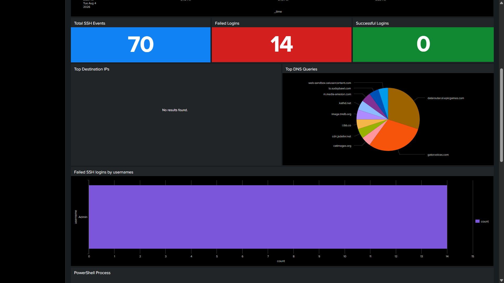

# SOC Dashboard

## Overview

The SOC Dashboard was created in Splunk Enterprise to provide a central view of activity from the Linux server and Windows endpoint.

The dashboard uses a time range filter and displays authentication activity, endpoint events, PowerShell activity, persistence-related events, and network activity.

## Dashboard Panels

### Events by Hosts

Shows events received from the monitored hosts.

### Event Timeline

Shows endpoint activity over time.

### Failed Login Trends

Displays failed authentication activity over time.

### Total SSH Events

Shows the total number of SSH-related events.

### Failed Logins

Shows the total number of failed login events.

### Successful Logins

Shows the total number of successful login events.

### Top Destination IPs

Shows the destination IP addresses observed in the collected events.

### Top DNS Queries

Displays DNS query activity collected from the monitored endpoints.

### Failed SSH Logins by Username

Shows usernames associated with failed SSH authentication attempts.

This can be used during SSH brute-force investigations to identify targeted accounts.

### PowerShell Process

Displays PowerShell process activity from the Windows endpoint.

The panel shows:

- Time
- Host
- Process name
- PowerShell executable
- Command line

This was used to review PowerShell activity during the encoded PowerShell command attack.

### Failed Login Attempts by IP

Shows failed authentication attempts grouped by source IP address.

This can help identify repeated authentication attempts from the same source.

### Persistence Mechanisms

Displays Linux persistence-related activity, including cron sessions and cron commands.

This was used during the Linux cron persistence attack simulation.

### Outbound Connections

Displays outbound connection activity observed in the collected logs.

## Purpose

The dashboard provides a single view for monitoring the lab environment and investigating activity generated during the attack simulations.

It was used to:

- Monitor endpoint activity
- Review authentication events
- Identify failed and successful logins
- Review PowerShell activity
- Monitor Linux cron activity
- Investigate attack activity
- Verify that logs were being received by Splunk

## Dashboard Screenshot

